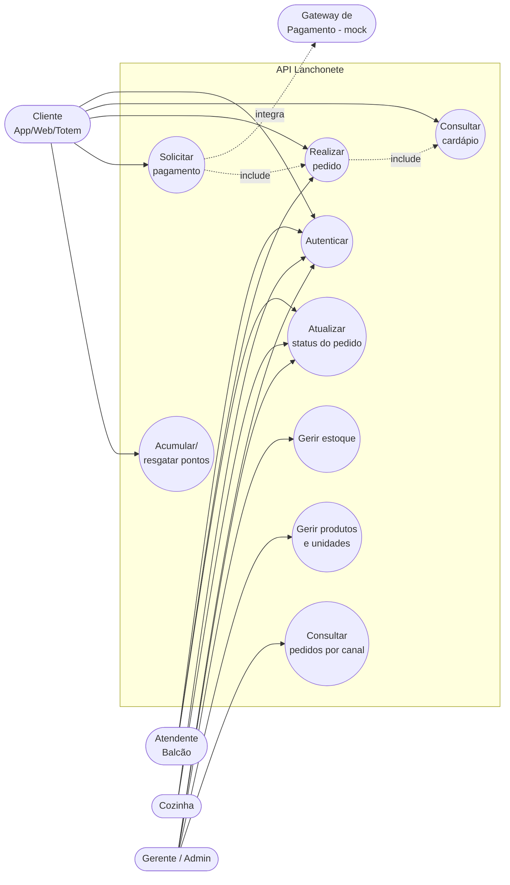

# Diagrama de Casos de Uso + Descrição de Feature

## 1. Diagrama de Casos de Uso

- **UC3 (Realizar pedido)** *inclui* a consulta de disponibilidade (cardápio/estoque).
- **UC4 (Solicitar pagamento)** depende de um pedido existente (relação *include*).
- O **Gateway** é um ator externo (sistema), acionado pelo UC4.

## 2. Descrição de Feature (fluxo crítico): Realizar Pedido + Solicitar Pagamento

| Campo | Descrição |
|-------|-----------|
| **Nome** | Realizar pedido e solicitar pagamento (Fluxo A) |
| **Ator principal** | Cliente (App/Totem/Web) |
| **Atores secundários** | Gateway de pagamento (mock); Cozinha/Gerente (status) |
| **Pré-condições** | Cliente autenticado (JWT); unidade existente; produtos com estoque na unidade |
| **Pós-condições** | Pedido criado e pago; estoque baixado; pontos creditados (se consentimento); status avançado |

### Fluxo principal
1. Cliente autentica (`POST /api/auth/login`) e recebe o token.
2. Cliente consulta o cardápio da unidade (`GET /api/unidades/{id}/cardapio`).
3. Cliente cria o pedido informando **canalPedido**, unidade e itens
   (`POST /api/pedidos`).
4. O sistema valida itens, verifica estoque por unidade, calcula o total no
   servidor, dá baixa no estoque (transação) e cria o pedido com status
   `AGUARDANDO_PAGAMENTO`.
5. Cliente solicita o pagamento (`POST /api/pagamentos`), que envia o payload ao
   gateway externo (mock) e registra o retorno.
6. Se **aprovado**: pedido vai para `PAGO` e pontos de fidelidade são creditados.
7. Cozinha/Gerente avança o status: `EM_PREPARO → PRONTO → ENTREGUE`.

### Fluxos de exceção / regras de negócio
- **canalPedido ausente/ inválido** → `422 VALIDACAO`.
- **Produto/unidade inexistente** → `404 NAO_ENCONTRADO`.
- **Estoque insuficiente** → `409 ESTOQUE_INSUFICIENTE` (não cria o pedido; nada é baixado).
- **Pagamento recusado** → pedido permanece `AGUARDANDO_PAGAMENTO`; mensagem coerente.
- **Gateway indisponível (timeout)** → `409 GATEWAY_INDISPONIVEL`; pagamento gravado como `PENDENTE` (tolerância a falha).
- **Transição de status inválida** → `409 TRANSICAO_INVALIDA` (máquina de estados).
- **Cancelamento** → devolve o estoque (movimentação de ENTRADA/estorno).
- **Idempotência/consistência** → baixa de estoque e criação do pedido ocorrem na
  mesma transação (`prisma.$transaction`), evitando estado parcial.
