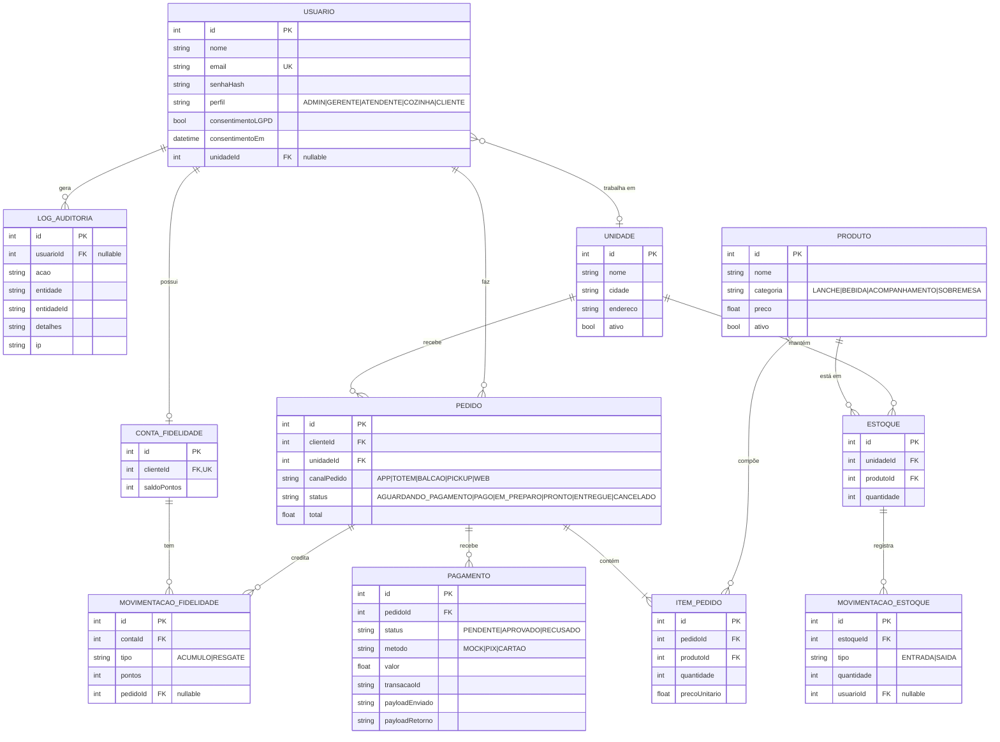

# DER — Diagrama Entidade-Relacionamento

Modelo de dados da API (compatível com o schema Prisma em
[`prisma/schema.prisma`](../prisma/schema.prisma)). Renderize o diagrama abaixo
no GitHub ou em https://mermaid.live.

## Cardinalidades e restrições principais

| Relacionamento                         | Cardinalidade | Restrição/Regra                                              |
|----------------------------------------|---------------|-------------------------------------------------------------|
| Unidade → Estoque                      | 1:N           | cada unidade tem **estoque próprio** por produto            |
| (Unidade, Produto) em Estoque          | —             | **UNIQUE(unidadeId, produtoId)**                            |
| Pedido → ItemPedido                    | 1:N           | pedido possui ao menos 1 item                               |
| Pedido → Pagamento                     | 1:N           | **pagamento desacoplado** (entidade própria; histórico)     |
| Usuário → ContaFidelidade              | 1:1           | **UNIQUE(clienteId)**                                       |
| Produto (exclusão)                     | —             | exclusão **lógica** (`ativo=false`) p/ preservar histórico  |

> Observação: o SQLite não possui tipo `ENUM` nativo; os enums são armazenados
> como `String` e validados na aplicação ([`src/domain/enums.js`](../src/domain/enums.js)).
> `payloadEnviado`/`payloadRetorno` e `detalhes` são JSON serializado em texto.
