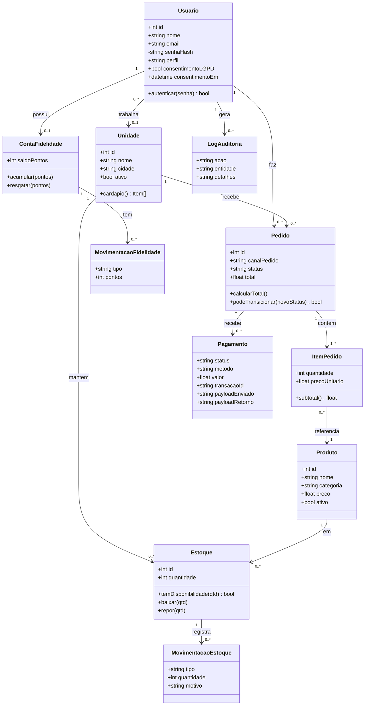

# Diagrama de Classes (visão de domínio)

> Os métodos representam o comportamento conceitual do domínio. Na implementação,
> essas regras vivem na camada de **Application** (serviços) usando os tipos/regras
> da camada **Domain** (enums, máquina de estados, erros) — ver
> [`src/application/`](../src/application) e [`src/domain/`](../src/domain).
