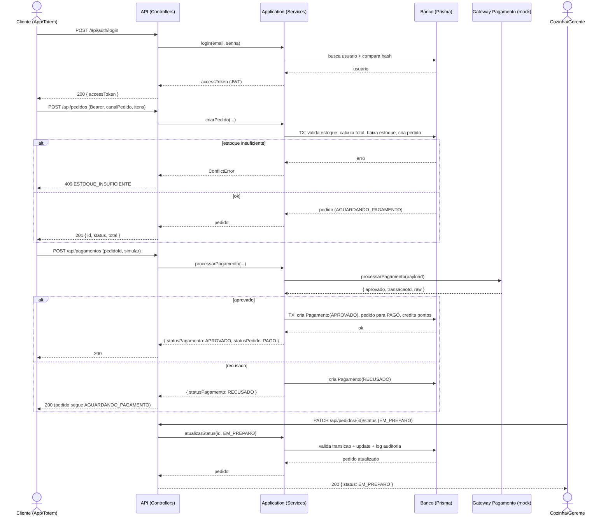

# Diagrama de Sequência — Fluxo Crítico

Pedido → Pagamento Externo (mock) → Atualização de Status.

```mermaid
sequenceDiagram
    actor C as Cliente (App/Totem)
    participant API as API (Controllers)
    participant APP as Application (Services)
    participant DB as Banco (Prisma)
    participant GW as Gateway Pagamento (mock)
    actor K as Cozinha/Gerente

    C->>API: POST /api/auth/login
    API->>APP: login(email, senha)
    APP->>DB: busca usuario + compara hash
    DB-->>APP: usuario
    APP-->>API: accessToken (JWT)
    API-->>C: 200 { accessToken }

    C->>API: POST /api/pedidos (Bearer, canalPedido, itens)
    API->>APP: criarPedido(...)
    APP->>DB: TX: valida estoque, calcula total, baixa estoque, cria pedido
    alt estoque insuficiente
        DB-->>APP: erro
        APP-->>API: ConflictError
        API-->>C: 409 ESTOQUE_INSUFICIENTE
    else ok
        DB-->>APP: pedido (AGUARDANDO_PAGAMENTO)
        APP-->>API: pedido
        API-->>C: 201 { id, status, total }
    end

    C->>API: POST /api/pagamentos (pedidoId, simular)
    API->>APP: processarPagamento(...)
    APP->>GW: processarPagamento(payload)
    GW-->>APP: { aprovado, transacaoId, raw }
    alt aprovado
        APP->>DB: TX: cria Pagamento(APROVADO), pedido para PAGO, credita pontos
        DB-->>APP: ok
        APP-->>API: { statusPagamento: APROVADO, statusPedido: PAGO }
        API-->>C: 200
    else recusado
        APP->>DB: cria Pagamento(RECUSADO)
        APP-->>API: { statusPagamento: RECUSADO }
        API-->>C: 200 (pedido segue AGUARDANDO_PAGAMENTO)
    end

    K->>API: PATCH /api/pedidos/{id}/status (EM_PREPARO)
    API->>APP: atualizarStatus(id, EM_PREPARO)
    APP->>DB: valida transicao + update + log auditoria
    DB-->>APP: pedido atualizado
    APP-->>API: pedido
    API-->>K: 200 { status: EM_PREPARO }
```
